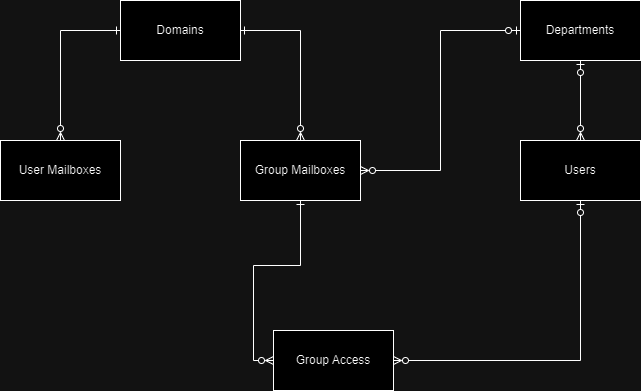

## Overview

This system is designed to manage user and group mailboxes, along with departments and domains, in a structured and secure manner. The database design integrates key entities such as departments, domains, users, user mailboxes, group mailboxes, and access control. It also provides logging functionality to track changes in these entities. The design supports basic CRUD (Create, Read, Update, Delete) operations on each of these entities, along with specialized views and procedures for easy access and manipulation.

## Entities

  

  
 Departments 

  <ul>
    <li><strong>Purpose</strong>:
        <ul>
        <li>The <code>departments</code> table represents organizational divisions within the company, such as HR, IT, Finance, etc.</li>
        </ul>
    </li>
    <li><strong>Key Attributes</strong>:
      <ul>
        <li><code>id</code>: Unique identifier for the department.</li>
        <li><code>department</code>: The name of the department (e.g., HR, IT).</li>
      </ul>
    </li>
    <li><strong>Design Considerations</strong>:
      <ul>
        <li>The <code>id</code> is the primary key, and <code>department</code> is unique to ensure no duplicates.</li>
        <li>Deletions are logged in the <code>deletion_logs</code> table for auditing.</li>
        <li><strong>Cascading Deletions</strong>: When a department is deleted, any associated users (via <code>department_id</code>) are updated by setting their <code>department_id</code> to <code>NULL</code>. This ensures the system maintains integrity, even when departments are removed.</li>
      </ul>
    </li>
  </ul>

  
 Domains 

  <ul>
    <li><strong>Purpose</strong>:
      <ul>
        <li>The <code>domains</code> table stores information about email domains, like "company.com" or "organization.org", which are linked to user and group mailboxes.</li>
      </ul>
    </li>
    <li><strong>Key Attributes</strong>:
      <ul>
        <li><code>id</code>: Unique identifier for the domain.</li>
        <li><code>domain</code>: The domain name (e.g., company.com).</li>
      </ul>
    </li>
    <li><strong>Design Considerations</strong>:
      <ul>
        <li>Each domain is uniquely identified by <code>domain</code>, which is constrained to prevent duplication.</li>
        <li><strong>Cascading Deletions</strong>: When a domain is deleted, the associated user mailboxes <code>users_mbs</code> and group mailboxes <code>group_mbs</code> — which in turn also triggers cascade deletions for group access <code>group_access</code> — are also deleted. This cascading behavior ensures that any data linked to the domain is removed.</li>
      </ul>
    </li>
  </ul>

  
 Users 

  <ul>
    <li><strong>Purpose</strong>:
      <ul>
        <li>The <code>users</code> table stores information about individual employees, including their first and last names, and links them to a department.</li>
      </ul>
    </li>
    <li><strong>Key Attributes</strong>:
      <ul>
        <li><code>id</code>: Unique identifier for the user.</li>
        <li><code>first_name</code>, <code>last_name</code>: Personal details of the user.</li>
        <li><code>department_id</code>: Foreign key to the `departments` table.</li>
      </ul>
    </li>
    <li><strong>Design Considerations</strong>:
      <ul>
        <li>Users are linked to departments via a foreign key (<code>department_id</code>), which helps organize the user base.</li>
        <li><strong>Cascading Deletions</strong>: When a department is deleted or updated, users are affected accordingly (i.e., setting <code>department_id</code> to <code>NULL</code> if a department is deleted).</li>
      </ul>
    </li>
  </ul>

  
 User Mailboxes 

  <ul>
    <li><strong>Purpose</strong>:
      <ul>
        <li>The <code>users_mbs</code> table stores individual user email addresses, linking them to a specific domain and user, along with their password.</li>
      </ul>
    </li>
    <li><strong>Key Attributes</strong>:
      <ul>
        <li><code>id</code>: Unique identifier for the mailbox.</li>
        <li><code>username</code>: The username part of the email address (e.g., jdoe).</li>
        <li><code>domain_id</code>: Foreign key to the `domains` table.</li>
        <li><code>owner_id</code>: Foreign key to the `users` table, indicating the user to whom the mailbox belongs.</li>
        <li><code>password</code>: The password for accessing the mailbox.</li>
      </ul>
    </li>
    <li><strong>Design Considerations</strong>:
      <ul>
        <li><code>username</code> and <code>domain_id</code> together form a unique constraint to ensure no duplicate mailboxes.</li>
        <li><strong>Cascading Deletions</strong>: Deleting a user or a domain will trigger cascading deletions on the associated user mailboxes, ensuring that all mailboxes linked to that user or domain are removed.</li>
      </ul>
    </li>
  </ul>

  
 Group Mailboxes 

  <ul>
    <li><strong>Purpose</strong>:
      <ul>
        <li>The <code>group_mbs</code> table stores email addresses for group mailboxes, which are typically used by departments or teams.</li>
      </ul>
    </li>
    <li><strong>Key Attributes</strong>:
      <ul>
        <li><code>id</code>: Unique identifier for the group mailbox.</li>
        <li><code>group_username</code>: The group email address (e.g., support).</li>
        <li><code>domain_id</code>: Foreign key to the `domains` table.</li>
        <li><code>department_id</code>: Foreign key to the `departments` table, linking the group mailbox to a specific department.</li>
        <li><code>password</code>: The password for accessing the group mailbox.</li>
      </ul>
    </li>
    <li><strong>Design Considerations</strong>:
      <ul>
        <li>Similar to user mailboxes, <code>group_username</code> and <code>domain_id</code> form a unique constraint.</li>
        <li><strong>Cascading Deletions</strong>: When a domain is deleted, any associated group mailboxes are deleted. This ensures that no orphaned group mailboxes remain in the system after the deletion of a domain. When a group mailbox is deleted, cascading deletions occur on the <code>group_access</code> table.</li>
      </ul>
    </li>
  </ul>

  
 Group Access 

  <ul>
    <li><strong>Purpose</strong>:
      <ul>
        <li>The <code>group_access</code> table tracks which users have access to which group mailboxes and provides additional security with an optional password for each user-group pair.</li>
      </ul>
    </li>
    <li><strong>Key Attributes</strong>:
      <ul>
        <li><code>id</code>: Unique identifier for the group access record.</li>
        <li><code>user_id</code>: Foreign key to the `users` table, indicating the user.</li>
        <li><code>group_mb_id</code>: Foreign key to the `group_mbs` table, indicating the group mailbox.</li>
        <li><code>app_password</code>: Optional password for accessing the group mailbox.</li>
      </ul>
    </li>
    <li><strong>Design Considerations</strong>:
      <ul>
        <li>The combination of <code>user_id</code> and <code>group_mb_id</code> must be unique, ensuring that a user can only have one access record per group mailbox.</li>
        <li><strong>Cascading Deletions</strong>: If a group mailbox is deleted (whether directly or via a cascading deletion), the related records in the <code>group_access</code> table are automatically deleted to maintain integrity.</li>
      </ul>
    </li>
  </ul>

## Logging

### 1. **Logs**
- **Purpose**: The `logs` table records all insertions and updates to the main entities (departments, domains, users, etc.). This helps maintain an audit trail of changes.
- **Design Considerations**:
  - Logs are generated automatically via triggers during INSERT and UPDATE operations. This ensures that every modification to the data is captured.

### 2. **Deletion Logs**
- **Purpose**: The `deletion_logs` table tracks deletions of records. It provides an additional layer of auditing to track which records were deleted and when.
- **Design Considerations**:
  - When a record is deleted (such as a department or domain), a log entry is generated with key identifiers to provide context for the deletion.
  - **Cascading Deletions and Logs**: Any cascading deletions (e.g., deleting users mailboxes when a domain is removed, or deleting group access when a group is removed) will trigger corresponding entries in the `deletion_logs` table.

## Views

The database contains several views to simplify access to critical information:
- **vdepartments**: Displays a list of all departments, ordered alphabetically.
- **vdomains**: Displays a list of all domains, ordered alphabetically.
- **vusers**: Displays users along with their department (if any), ordered by department and name.
- **vusers_mbs**: Displays user mailboxes, including the owner's name and the email address.
- **vgroup_mbs**: Displays group mailboxes, including the department name and the email address.
- **vgroup_access**: Displays which users have access to which group mailboxes.

## Stored Procedures

To manage the entities efficiently, several stored procedures are provided for performing CRUD operations on each table:
- **Departments**: Includes procedures for viewing, inserting, updating, and deleting departments.
- **Domains**: Includes procedures for managing domains.
- **Users**: Procedures for managing user records, including associating users with departments.
- **User Mailboxes**: Procedures for managing individual user mailboxes.
- **Group Mailboxes**: Procedures for managing group mailboxes and their access.
- **Group Access**: Procedures for managing access control to group mailboxes.

## Triggers

Triggers are set up to automatically log changes and maintain integrity:
- **Insert triggers**: Capture insertions into each key table (e.g., `departments`, `domains`, `users`).
- **Update triggers**: Log updates to existing records in the key tables.
- **Delete triggers**: Log deletions and handle cascading deletions where necessary (e.g., deleting mailboxes when a domain is removed). Cascading deletions also trigger logs to record the deleted records for audit purposes.

## Security and Integrity Considerations

- **Foreign Key Constraints**: The use of foreign keys ensures that relationships between users, departments, domains, and mailboxes are preserved. When a department or domain is deleted, related records are either set to `NULL` or deleted through cascading actions.
- **Unique Constraints**: The system ensures uniqueness where necessary, particularly for email addresses (`users_mbs` and `group_mbs`) to prevent duplicates.
- **Logging and Auditing**: All changes to critical data are logged, providing traceability for changes, updates, and deletions.
- **Cascading Logs**: Cascading actions (such as deletions or updates that affect multiple records) also trigger logs, ensuring that even bulk actions are recorded for auditing.
- **Transaction Handling**: All operations are wrapped in transactions to ensure data consistency and rollback in case of errors.

## Conclusion

The database design provides a robust framework for managing users, mailboxes, and their associated departments and domains, with strong support for logging, auditing, and access control. The use of views and stored procedures simplifies common operations, while triggers and cascading behaviors ensure data integrity and transparency. This design allows for effective management of user data and email-related resources in an organizational context, while providing detailed logs for security and compliance purposes.

## Database in Action:

- For a video overview of the database in action, please visit this URL: https://youtu.be/PXbdWN5_LGM
